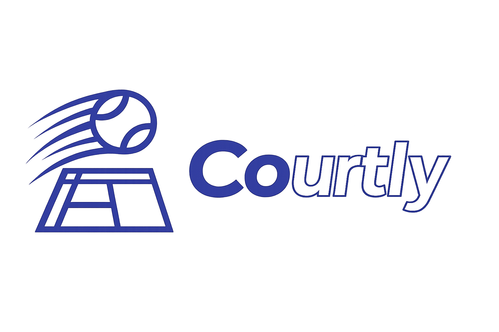
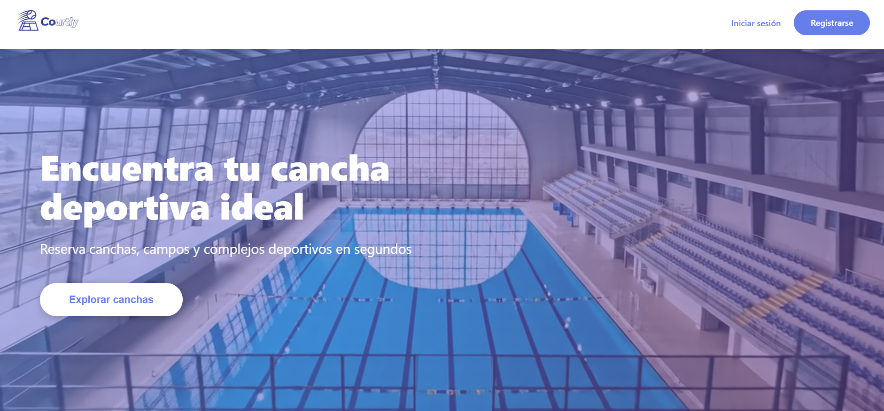
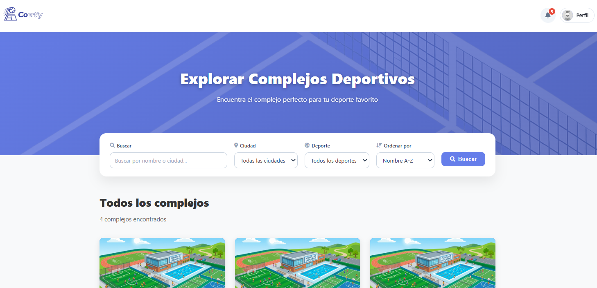
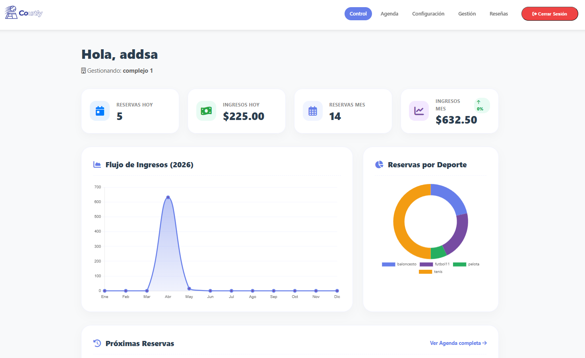

# Courtly - Plataforma de Gestión y Reserva de Canchas Deportivas

<p align="center">
    
</p>

Courtly es una plataforma web integral diseñada para conectar a deportistas apasionados con propietarios de complejos deportivos. Simplifica el proceso de encontrar y alquilar canchas, al mismo tiempo que ofrece a los dueños un panel de administración robusto para gestionar sus instalaciones, reservas e ingresos de manera centralizada.

## 🌟 Características Principales

La aplicación está dividida en dos experiencias principales dependiendo del rol del usuario:

### 🎾 Para Jugadores
* **Búsqueda Avanzada:** Encuentra complejos deportivos filtrando por ciudad y deporte.
* **Exploración de Complejos:** Visualiza información detallada de cada recinto (nombre, ubicación, información de contacto, servicios ofrecidos y reseñas de otros usuarios).
* **Disponibilidad en Tiempo Real:** Consulta los horarios disponibles de cada cancha y su precio por hora.
* **Reservas y Pagos:** Gestiona tu reserva directamente desde la plataforma.
* **Panel Personal:** Lleva el control de tus reservas pendientes y revisa tu historial de partidos finalizados.
* **Sistema de Reseñas:** Recibe notificaciones al finalizar tu reserva para calificar tu experiencia y ayudar a la comunidad.

### 💼 Para Dueños de Complejos
* **Dashboard Estadístico:** Visualiza métricas clave como ingresos diarios/mensuales, volumen de reservas y los deportes más demandados en tu complejo.
* **Agenda Interactiva:** Revisa la programación diaria de tus canchas, incluyendo los datos de contacto de los titulares de cada reserva para una gestión fluida.
* **Gestión de Infraestructura:** Añade, edita o elimina canchas ajustando precios, deportes y características al instante.
* **Configuración de Perfil:** Mantén actualizada la información pública de tu complejo (servicios, ubicación, contacto) que verán los jugadores.
* **Monitor de Reseñas:** Lee y analiza el feedback directo de tus clientes para mejorar tu servicio.

---

## 🛠️ Tecnologías Utilizadas

* **Backend:** Python / Django / Django Rest Framework
* **Frontend:** HTML5, CSS3, JavaScript (Vanilla)
* **Base de Datos:** PostgreSQL
* **Despliegue y Contenedores:** Docker & Docker Compose

---

## 🚀 Instalación y Despliegue (Local)

El proyecto está dockerizado para facilitar su instalación. Sigue estos pasos para levantar el entorno de desarrollo en tu máquina local:

### Prerrequisitos
Asegúrate de tener instalado [Docker](https://www.docker.com/products/docker-desktop) y [Docker Compose](https://docs.docker.com/compose/install/) en tu sistema.

### Pasos de instalación

1. **Clona este repositorio:**
   ```bash
   git clone [https://github.com/GianlucaDamico/ProyectoGS](https://github.com/GianlucaDamico/ProyectoGS)
   cd courtly
   ```

2. **Configura las variables de entorno:**
    ```bash
    cp .env.example .env
    ```
    Abre el archivo .env en tu editor de código y completa las variables necesarias (credenciales de base de datos, secret keys, etc.).

3. **Construye las imágenes de Docker:**
    ```bash
    docker compose build
    ```

4. **Levanta los contenedores en segundo plano:**
    ```bash
    docker compose up -d
    ```

5. **Genera y aplica las migraciones de la base de datos:**
    ```bash
    docker compose exec web python manage.py makemigrations
    ```
    ```bash
    docker compose exec web python manage.py migrate
    ```
6. **Crear un superusuario (opcional para probar admin)**
    ```bash
    docker compose exec web python manage.py createsuperuser
    ```

 ¡Listo! La aplicación debería estar corriendo en http://localhost:8000 (o el puerto que hayas configurado).

---

## 📸 Muestras

<p align="center">
  <table>
    <tr>
        <td align="center">
        <strong>Landing Page</strong><br>
        
      </td>
      <td align="center">
        <strong>Vista Jugador</strong><br>
        
      </td>
      <td align="center">
        <strong>Vista Propietario</strong><br>
        
      </td>
    </tr>
  </table>
</p>

--- 

## 🤝 Contribuciones

Este proyecto nació como una primera experiencia colaborativa entre los integrantes del equipo. Somos conscientes de que, al ser un trabajo inicial, existen áreas con margen de mejora, como por ejemplo:

*   **Seguridad y Permisos:** La lógica de acceso a ciertas vistas y la validación de roles de usuario pueden presentar inconsistencias.
*   **Arquitectura de Código:** Es posible encontrar secciones con código desordenado o redundante.
*   **Documentación:** No realizamos buenas prácticas de documentación desde un inicio.
*   **Optimización:** Algunas consultas a la base de datos podrían mejorarse para un mayor rendimiento.

¡Las sugerencias y mejoras son más que bienvenidas!
---

## 👥 Equipo de Desarrollo

* **Mario Del Agua** - [GitHub](https://github.com/akkaagua)
* **Victor Almira** - [GitHub](https://github.com/victor-almira)
* **Gianluca D'Amico** - [GitHub](https://github.com/GianlucaDamico)